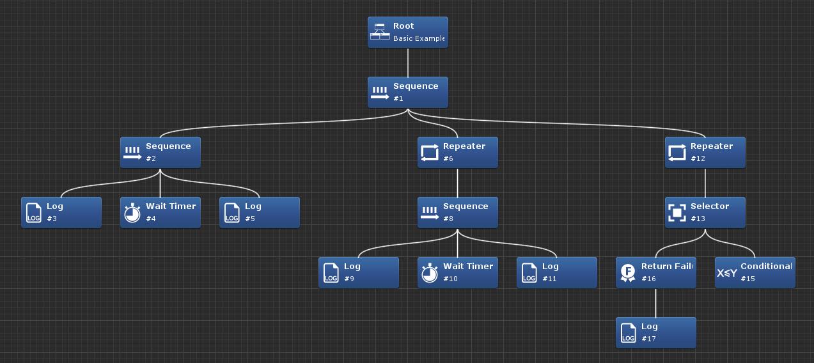
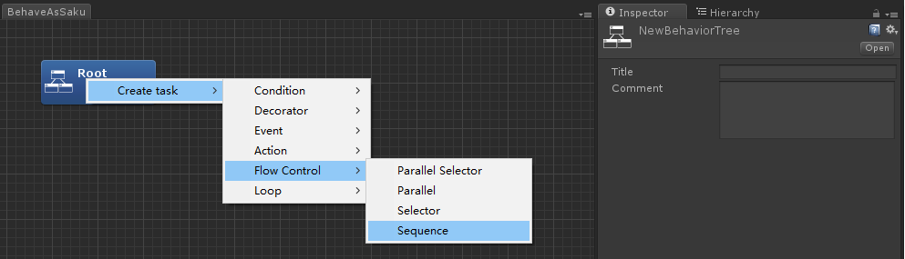

# BehaveAsSakura



**BehaveAsSakura** is a [behavior tree](http://www.gamasutra.com/blogs/ChrisSimpson/20140717/221339/Behavior_trees_for_AI_How_they_work.php) implementation for .NET and Unity. BehaveAsSakura provides several features to build multiplayer networking games with behavior trees easier.

## Features

* Behavior trees are event-driven to avoid traversal of entire trees every frame and improve execution performance significantly.
* Traversal of trees and execution of tasks are deterministic which means simulations on client and server will give exactly the same result.
* Description of behavior tree is serialized with [FlatBuffers](https://google.github.io/flatbuffers/) so it is insanely fast to load trees into memory.
* Internal states of behavior trees are also serializable in case a full synchronization is necessary.
* A intuitive visual editor is provided in Unity with runtime debugging support.

## Installation

### .NET

Build the solution and copy assemblies under `BehaveAsSakura\bin` directory into your project.

### Unity

Copy `BehaveAsSakuraUnity\Assets\BehaveAsSakura` directory into your Unity project.

## Usage

### Create a behavior tree description

A behavior tree description contains the tree structure of various tasks and description of tasks which are modifiable during runtime. There are two ways to create a behavior tree description.

One is create it with Unity Editor:

1. Create a behavior tree asset from menu **Assets -> Create -> BehaveAsSakura Behavior Tree**.
2. Select the new asset and it will open the editor window and custom inspector of tree description. 
3. Right click on the entry node and select **Create task -> Action -> Log** in context menu.
4. Select the new task and it will open the custom inspector of task.
5. Edit the **Message** field and the behavior tree asset is saved automatically.

Another one is create a description from the fluent API.

```csharp
// Build tree description via fluent API
var treeBuilder = new BehaviorTreeBuilder();
builder.Composite<SequenceTaskDesc>()
    .AppendChild(builder.Leaf<LogTaskDesc>(
        d => d.Message = "Start waiting"))
    .AppendChild(builder.Leaf<WaitTimerTaskDesc>(
        d => d.Time = new VariableDesc(VariableType.UInteger, VariableSource.LiteralConstant, "3000")))
    .AppendChild(builder.Leaf<LogTaskDesc>(d =>
        d.Message = "End waiting"));
var treeDesc = treeBuilder.Build();

// Write tree description into file
BehaviorTreeSerializer.Initialize(new FlatBuffersSerializer());
var bytes = BehaviorTreeSerializer.SerializeDesc(treeDesc);
File.WriteAllBytes("path/to/tree.bas", bytes);
```

## Licensing

**BehaveAsSakura** is licensed under the Apache License, Version 2.0. See [LICENSE](LICENSE) for the full license text.
